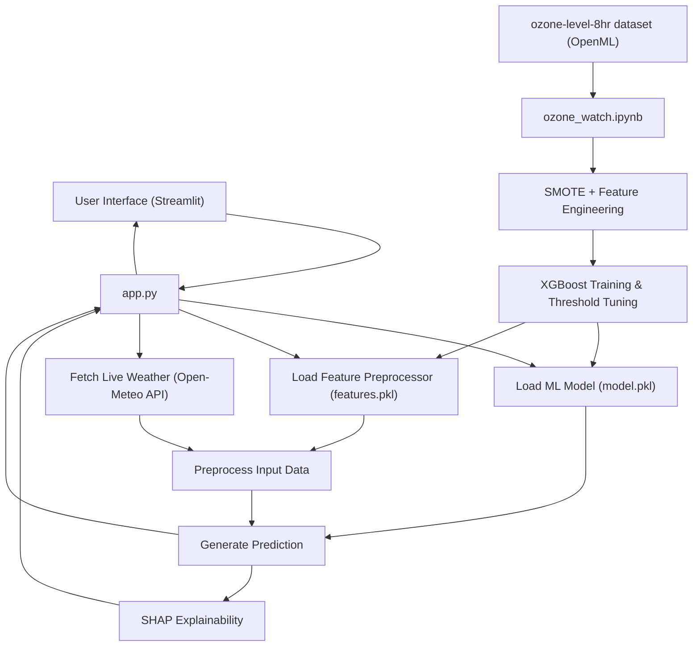

# OzoneWatch 🌿

**Real-time Ozone Level Prediction System**

[](https://ozonewatch.streamlit.app)
[](https://www.python.org/)
[](https://streamlit.io)
[](LICENSE)

OzoneWatch is a machine learning–powered air quality monitoring system that predicts 8-hour average atmospheric ozone concentrations in real time. It integrates live weather data via the Open-Meteo API and provides interpretable predictions using SHAP explainability — making it useful for environmental agencies, health organizations, and researchers.

---

## Features

- **XGBoost Classifier** trained on 2,534 samples with 73 meteorological features
- **SMOTE oversampling** to handle class imbalance in ozone event detection
- **SHAP explainability** — highlights top contributing features (e.g., solar radiation V62) for each prediction
- **Live weather integration** via Open-Meteo API (Houston, TX as default location)
- **Threshold-tuned predictions** optimized for high recall (0.91) to minimize missed ozone alerts
- **Streamlit web interface** — clean, interactive UI with no setup required for end users

---

## Model Performance

| Metric    | Score |
|-----------|-------|
| Recall    | 0.91  |
| Precision | —     |
| F1        | —     |

> Recall was prioritized as the primary metric — in air quality monitoring, missing a real ozone event (false negative) is more costly than a false alarm.

---

## Architecture



---

## Project Structure

```
ozone-watch/
├── .gitignore
├── README.md
├── app.py                   # Streamlit web application
├── data/
│   └── ozone-level-8hr.arff # Source dataset (OpenML, 2534 rows, 73 features)
├── features.pkl             # Pickled feature preprocessor (ColumnTransformer / StandardScaler)
├── model.pkl                # Pickled trained XGBoost model
├── ozone_watch.ipynb        # Full ML workflow: EDA, SMOTE, training, SHAP, threshold tuning
├── requirements.txt
└── LICENSE
```

---

## Installation

1. **Clone the repository:**
   ```bash
   git clone https://github.com/Manan-55/ozone-watch.git
   cd ozone-watch
   ```

2. **Create a virtual environment (recommended):**
   ```bash
   python -m venv venv
   # Windows
   .\venv\Scripts\activate
   # macOS/Linux
   source venv/bin/activate
   ```

3. **Install dependencies:**
   ```bash
   pip install -r requirements.txt
   ```

---

## Usage

**Run the app locally:**
```bash
streamlit run app.py
```
The app will be accessible at `http://localhost:8501` in your browser.

**Or visit the live deployment directly:**
👉 [ozonewatch.streamlit.app](https://ozonewatch.streamlit.app)

**Explore the ML workflow:**
```bash
jupyter notebook ozone_watch.ipynb
```

---

## Tech Stack

| Layer         | Technology                          |
|---------------|-------------------------------------|
| ML Model      | XGBoost, scikit-learn               |
| Imbalance     | SMOTE (imbalanced-learn)            |
| Explainability| SHAP                                |
| Live Data     | Open-Meteo API                      |
| Frontend      | Streamlit                           |
| Dataset       | ozone-level-8hr (OpenML, ARFF)      |

---

## License

This project is licensed under the MIT License. See [LICENSE](LICENSE) for details.

---

## Contact

**Manan Prajapati**
GitHub: [@Manan-55](https://github.com/Manan-55)
